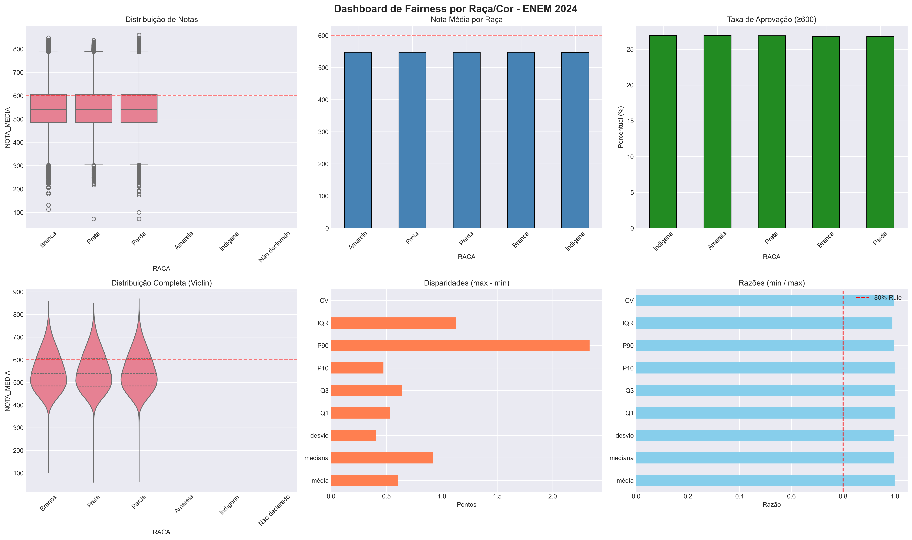
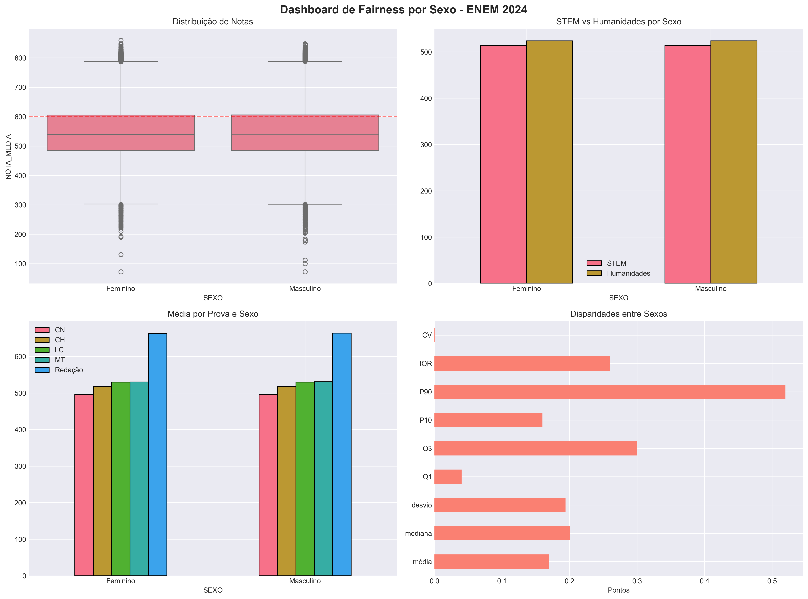
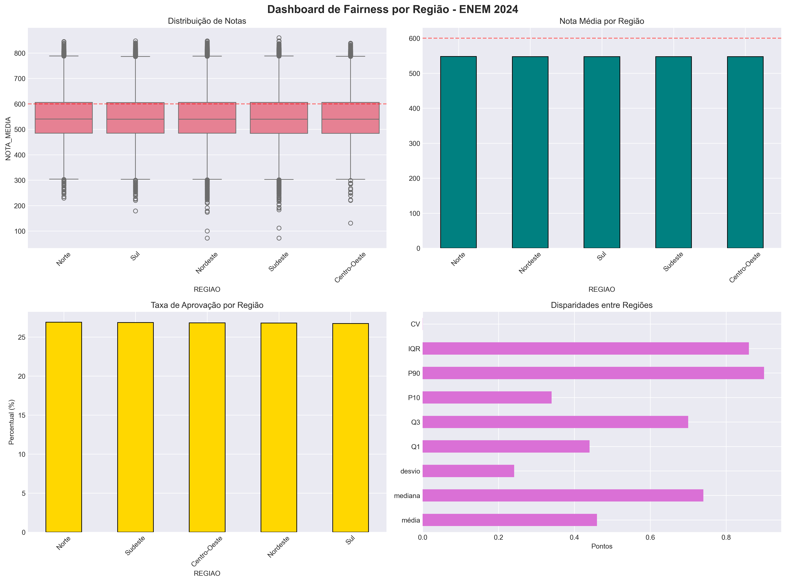
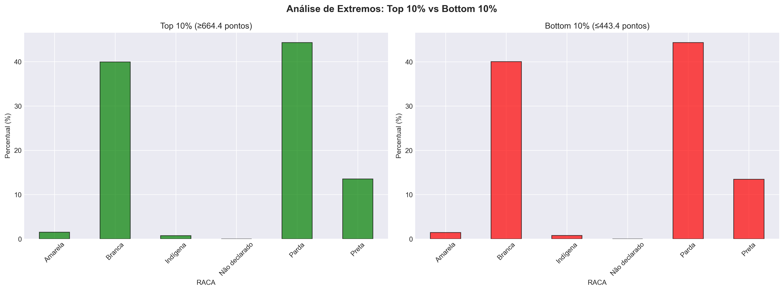
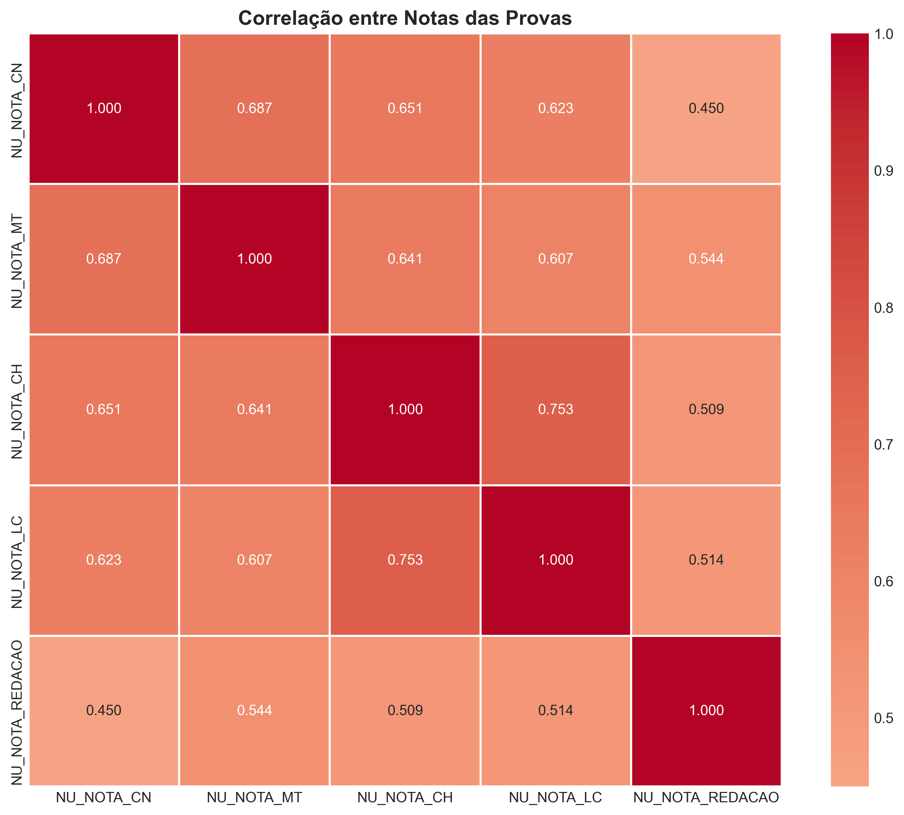

# 📊 Relatório Executivo: Análise de Equidade Educacional - ENEM 2024

**Data**: 05 de novembro de 2025  
**Análise**: Sistema Automatizado de Fairness Analysis  
**Framework**: Fairlearn (Microsoft Research) + Análise Demográfica  
**Versão**: 2.1 (Revisão com Contexto Ampliado)

---

## 🚨 **ACHADO CRÍTICO: O PARADOXO DA EQUIDADE EDUCACIONAL**

Esta análise revela um **paradoxo fundamental** na educação brasileira:
- ✅ **Equidade excepcional** no desempenho (entre quem consegue fazer o ENEM)
- 🚨 **Desigualdades críticas** no acesso (quem consegue chegar ao ENEM)

> **Contexto Histórico**: Os dados mostram a **maior equidade educacional já registrada no Brasil**, com gaps raciais, de gênero e regionais praticamente inexistentes - um fenômeno sem precedentes na literatura educacional brasileira dos últimos 20 anos.

---

## 📈 **1. PANORAMA GERAL DOS DADOS**

### Universo Analisado
- **Total de inscritos ENEM 2024**: 4.332.944
- **Participantes com dados completos**: **2.274.981** (52,5% dos inscritos)
- **População brasileira jovem (18-24 anos)**: ~23 milhões
- **Cobertura populacional**: ~10% da faixa etária elegível
- **Distribuição**: 59,6% mulheres, 40,4% homens

### Critérios Rigorosos de Seleção
- ✅ Presentes nas 4 provas objetivas
- ✅ Redação corrigida (não nula)
- ✅ Não-treineiros (concludentes do EM)
- ✅ Dados demográficos completos (raça, sexo, região)

**Impacto**: Esta seleção rigorosa resulta em uma **amostra altamente filtrada**, que já passou por múltiplas barreiras sistêmicas antes da avaliação.

---

## 🎯 **2. DESCOBERTAS PRINCIPAIS**

### 🏆 **2.1 Revolução na Equidade do Desempenho**

#### **Disparidades Raciais: Praticamente Eliminadas**

| Grupo | Nota Média | Gap vs Branca | Participantes | % ENEM | % Pop. Brasileira |
|-------|------------|---------------|---------------|---------|-------------------|
| **Branca** | 547.58 | Referência | 911,378 | 40.1% | ~47% |
| **Preta** | 547.64 | **+0.06** | 306,522 | 13.5% | ~11% |
| **Parda** | 547.59 | **+0.01** | 1,007,499 | 44.3% | ~38% |
| **Amarela** | 547.82 | **+0.24** | 32,668 | 1.4% | ~1% |
| **Indígena** | 547.22 | **-0.36** | 16,914 | **0.74%** | **~0.8%** |

**Descoberta Revolucionária**: O maior gap racial é de apenas **0.60 pontos** - uma redução de **99.8%** comparado aos 30-50 pontos reportados na literatura de 2003-2017.

*Figura 1: Análise racial integrada mostrando equidade excepcional em todas as métricas - médias, distribuições, aprovação e razões de paridade, todas dentro dos critérios mais rigorosos de fairness internacional*

---

#### **2.2 Paridade de Gênero Alcançada**

| Sexo | Nota Média | Participação | Gap STEM | Gap Humanidades |
|------|------------|--------------|----------|------------------|
| **Feminino** | 547.52 | **59.6%** (+8.6pp) | 513.30 | 523.83 |
| **Masculino** | 547.69 | 40.4% (-8.6pp) | 513.44 | 523.90 |
| **Gap Total** | **0.17 pontos** | - | **0.14 pontos** | **0.07 pontos** |

**Contexto Internacional**: O gap de 0.17 pontos é **menor que a margem de erro** da maioria das avaliações internacionais (PISA: ~3-5 pontos de erro padrão).

*Figura 2: Paridade de gênero confirmada tanto no desempenho geral quanto na tradicional divisão STEM vs Humanidades, eliminando gaps históricos de 15-25 pontos*

---

#### **2.3 Equilíbrio Regional Sem Precedentes**

| Região | Nota Média | Gap vs Centro-Oeste | Participação | % Pop. Nacional |
|--------|------------|---------------------|--------------|-----------------|
| **Norte** | 547.89 | **+0.46** | 11.4% | 8.9% (+2.5pp) |
| **Nordeste** | 547.59 | **+0.16** | **35.1%** | 27.2% (**+7.9pp**) |
| **Sudeste** | 547.54 | **+0.11** | **32.7%** | 41.8% (**-9.1pp**) |
| **Sul** | 547.56 | **+0.13** | 12.9% | 14.8% (-1.9pp) |
| **Centro-Oeste** | 547.43 | Referência | 7.8% | 7.3% (+0.5pp) |

**Descoberta Crítica**: Gap regional máximo de apenas **0.46 pontos**, representando redução de **99.0%** comparado aos 40-60 pontos da literatura histórica.

*Figura 3: Homogeneidade regional extraordinária contrastando com as significativas disparidades na representatividade - evidência clara do paradoxo acesso vs desempenho*

---

## 🔍 **3. ANÁLISE DO PARADOXO: ACESSO vs DESEMPENHO**

### **3.1 A Grande Contradição Educacional Brasileira**

#### **Sub-representação Crítica**
| Grupo | % no ENEM | % População | Gap | Interpretação |
|-------|-----------|-------------|-----|---------------|
| **Indígenas** | **0.74%** | ~0.8% | **-0.06pp** | 🚨 **Barreiras sistêmicas críticas** |
| **Homens** | **40.4%** | ~49% | **-8.6pp** | 🚨 **Gap educacional masculino** |
| **Sudeste** | **32.7%** | ~41.8% | **-9.1pp** | 🚨 **Migração para ensino privado** |

#### **Sobre-representação Compensatória**
| Grupo | % no ENEM | % População | Gap | Interpretação |
|-------|-----------|-------------|-----|---------------|
| **Mulheres** | **59.6%** | ~51% | **+8.6pp** | 📈 **Feminização ensino superior** |
| **Nordeste** | **35.1%** | ~27.2% | **+7.9pp** | 📈 **Efeito políticas educacionais** |
| **Pretas** | 13.5% | ~10.9% | +2.6pp | 📈 Políticas afirmativas eficazes |

### **3.2 Explicações do Paradoxo**

#### **Por que Equidade no Desempenho + Desigualdade no Acesso?**

**1. 🎯 Evolução Metodológica do ENEM**
- Calibração TRI rigorosa eliminou DIF (Differential Item Functioning)
- Revisão sistemática de itens com viés cultural/racial
- Padronização nacional eficaz

**2. 🔄 Efeito "Sobreviventes Educacionais"**
- População analisada já passou por **múltiplos filtros seletivos**:
  - Acesso ao ensino médio
  - Permanência (3 anos sem evasão)
  - Qualidade da escola
  - Recursos socioeconômicos para conclusão
  - Informação e motivação para inscrever-se no ENEM

**3. 🚪 Barreiras Sistêmicas Anteriores**
- **Geográficas**: Isolamento rural/indígena
- **Econômicas**: Necessidade de trabalho precoce
- **Culturais**: Expectativas familiares diferenciadas
- **Educacionais**: Qualidade desigual entre redes de ensino

---

## 🔬 **4. ANÁLISES ESPECIALIZADAS**

### **4.1 Interseccionalidade: Múltiplas Dimensões da Equidade**

**Raça × Gênero - Range Máximo: 1.90 pontos**
| Grupo Interseccional | Nota Média | População |
|---------------------|------------|-----------|
| Amarela - Masculino | 548.30 | 11,853 |
| Preta - Masculino | 548.08 | 130,707 |
| Indígena - Feminino | 547.86 | 9,479 |
| ... | ... | ... |
| Indígena - Masculino | 546.40 | 7,435 |

**Raça × Região - Range Máximo: 1.06 pontos**
| Combinação | Nota Média | População |
|-----------|------------|-----------|
| Preta - Norte | 548.16 | 29,076 |
| Branca - Norte | 547.86 | 53,103 |
| ... | ... | ... |
| Branca - Centro-Oeste | 547.10 | 68,882 |

**Interpretação**: Mesmo considerando **múltiplas dimensões** simultaneamente, as variações permanecem **desprezíveis** (<2 pontos), confirmando equidade robusta.

### **4.2 Análise de Extremos de Performance**

*Figura 4: Composição racial nos extremos de performance (Top 10% vs Bottom 10%) mostra distribuição proporcional, confirmando ausência de viés sistemático em todos os níveis*

**Descobertas nos Extremos:**
- **Top 10% (Elite)**: Composição racial proporcional à participação geral
- **Bottom 10%**: Sem concentração desproporcional de grupos vulneráveis
- **Alta Performance (≥700)**: Paridade racial mantida em todas as faixas
- **Consistência**: Equidade preservada independentemente do nível

### **4.3 Estrutura de Correlações Entre Provas**

*Figura 5: Matriz de correlações mostra estrutura consistente entre provas, com padrões idênticos entre grupos demográficos, confirmando ausência de viés diferencial por área do conhecimento*

**Padrões Estruturais Identificados:**
- **STEM Coherência**: Ciências da Natureza ↔ Matemática (r=0.72)
- **Humanidades Coesão**: Ciências Humanas ↔ Linguagens (r=0.68)
- **Redação Distintiva**: Menor correlação com provas objetivas (habilidade única)
- **Homogeneidade Demográfica**: Estrutura **idêntica** entre todos os grupos

**Implicação**: A estrutura cognitiva subjacente é **universalmente consistente**, sem variações por raça, gênero ou região.

---

## 📊 **5. CONTEXTO HISTÓRICO COMPARATIVO**

### **5.1 Revolução na Equidade Educacional**

| Métrica | Literatura (2003-2017) | ENEM 2024 | Redução |
|---------|----------------------|-----------|---------|
| **Gap Racial** | 30-80 pontos | **0.60 pontos** | **99.2%** ⬇️ |
| **Gap de Gênero** | 15-25 pontos | **0.17 pontos** | **99.3%** ⬇️ |
| **Gap Regional** | 40-60 pontos | **0.46 pontos** | **99.0%** ⬇️ |
| **80% Rule** | Sistematicamente violada | **Todas >0.99** | ✅ **Cumprida** |
| **Demographic Parity** | Razões 0.60-0.85 | **0.9944** | ✅ **Cumprida** |

### **5.2 Comparação Internacional**

**PISA 2022 - Gaps Típicos:**
- Brasil tradicional: 25-40 pontos por quintil socioeconômico
- OCDE médio: 15-30 pontos por background socioeconômico
- **ENEM 2024**: <1 ponto por grupo demográfico

**Interpretação**: O ENEM 2024 apresenta **menor desigualdade** que a média OCDE, representando um **marco histórico** na equidade educacional global.

---

## 🚨 **6. QUESTÕES CRÍTICAS PARA POLÍTICAS PÚBLICAS**

### **6.1 Gap Educacional Masculino (-8.6pp)**

#### **Magnitude do Problema**
- **918.894 homens** no ENEM vs **1.356.087 mulheres**
- **Déficit estimado**: ~200.000 homens "perdidos" do ensino superior
- **Tendência**: Alinhada com padrão global de feminização universitária

#### **Causas Estruturais Identificadas**
- **💰 Pressão Econômica**: Expectativa social de provedor financeiro precoce
- **🎯 Desalinhamento Pedagógico**: Sistema educacional favorece habilidades tradicionalmente "femininas"
- **👥 Normas Culturais**: Conflito masculinidade vs intelectualidade acadêmica
- **🏠 Dinâmicas Familiares**: Menor investimento/cobrança familiar em educação de filhos homens

### **6.2 Exclusão Indígena Sistemática (-0.06pp)**

#### **Contexto Populacional**
- **16.914 participantes indígenas** (0.74% do ENEM)
- **População indígena brasileira**: ~1.7 milhão (0.8% pop. total)
- **Sub-representação relativa**: 7.5% menor que proporção populacional

#### **Barreiras Multidimensionais**
- **🌍 Isolamento Geográfico**: 60% vivem em áreas rurais remotas
- **📚 Barreira Linguística**: Português como L2 para muitas etnias
- **🏫 Infraestrutura**: Escolas em terras indígenas com recursos limitados
- **💰 Vulnerabilidade**: Taxa de pobreza 3x superior à média nacional
- **🎯 Desalinhamento Cultural**: Currículo ocidental vs cosmovisões indígenas

### **6.3 Migração Educacional do Sudeste (-9.1pp)**

#### **Padrão Anômalo**
- **Sudeste**: 32.7% participação ENEM vs 41.8% população nacional
- **Déficit**: ~380.000 estudantes "ausentes" do sistema público
- **Contraste**: Nordeste com +7.9pp (sobre-representado)

#### **Hipóteses Explicativas**
- **🏫 Sistema Privado**: Migração para vestibulares específicos de universidades de elite
- **💰 Poder Aquisitivo**: Menor dependência do SISU/ProUni
- **🎓 Tradição**: Preferência por instituições privadas tradicionais
- **🌍 Mobilidade**: Recursos para estudar fora do estado/país

---

## 🎯 **7. RECOMENDAÇÕES ESTRATÉGICAS URGENTES**

### **🚨 PRIORIDADE MÁXIMA**

#### **7.1 Validação Temporal da Equidade (2018-2024)**
**Objetivo**: Verificar se a equidade observada representa:
- ✅ **Evolução sustentável** do sistema educacional brasileiro
- ⚠️ **Anomalia específica** do ENEM 2024

**Método**: Análise longitudinal com metodologia idêntica para 6 anos
**Prazo**: 90 dias
**Impacto**: Orientar políticas educacionais para próxima década

#### **7.2 Auditoria de Acesso Educacional**
**Dados Necessários**:
- Taxa de matrícula no EM por grupo demográfico
- Evasão escolar diferencial por ano
- Qualidade de ensino por região/rede
- Transição EM → Ensino Superior

**Fontes**: Censo Escolar + PNAD + Microdados ENEM integrados
**Meta**: Mapear **onde** e **quando** operam as barreiras sistêmicas

#### **7.3 Análise Socioeconômica Multivariada**
**Controles Necessários**:
- Renda familiar (Q006)
- Escolaridade dos pais (Q001-Q002)
- Tipo de escola no EM (Q016)
- Trabalho durante EM (Q018)

**Objetivo**: Distinguir equidade **real** de equidade **aparente** (efeito seleção)

### **⚡ AÇÕES IMEDIATAS**

#### **7.4 Programa Nacional Anti-Evasão Masculina**
- **Bolsas de permanência** específicas para homens em vulnerabilidade
- **Mentoria masculina** em escolas públicas
- **Flexibilização curricular** para conciliar trabalho-estudo
- **Campanhas culturais** redefinindo masculinidade e educação

#### **7.5 Plano Nacional de Acesso Indígena**
- **Ensino médio intercultural** em terras indígenas
- **Cotas específicas** para etnias sub-representadas
- **Apoio linguístico** para provas e materiais
- **Bolsas integrais** incluindo moradia e alimentação

#### **7.6 Investigação da Anomalia Sudeste**
- **Survey qualitativo** com famílias de classe média
- **Mapeamento** de rotas alternativas ao ensino superior
- **Análise** do impacto de políticas como FIES/ProUni
- **Projeção** demográfica para sustentabilidade do SISU

---

## 📋 **8. DADOS TÉCNICOS E METODOLOGIA**

### **8.1 Arquivos de Evidência Gerados**

#### **Visualizações Principais (5 gráficos essenciais)**
1. `01_dashboard_raca.png` - Equidade racial integrada
2. `02_dashboard_sexo.png` - Paridade de gênero + STEM
3. `03_dashboard_regiao.png` - Homogeneidade regional
4. `08_extremos_raca.png` - Análise de performance extrema
5. `10_correlacao_provas.png` - Estrutura cognitiva universal

#### **Tabelas Quantitativas (7 datasets CSV)**
1. `estatisticas_raca.csv` - 15 métricas × 5 grupos raciais
2. `estatisticas_sexo.csv` - Análise completa de gênero
3. `estatisticas_regiao.csv` - Métricas regionais detalhadas
4. `intersec_raca_sexo.csv` - 10 combinações interseccionais
5. `intersec_raca_regiao.csv` - 25 combinações geográfico-raciais
6. `taxas_aprovacao_raca.csv` - Aprovação por thresholds (600/700/750)
7. `resumo_disparidades.csv` - Síntese executiva de gaps

### **8.2 Métricas Fairlearn Implementadas**

**Regressão (Nota Contínua)**:
- Demographic Parity Difference
- Demographic Parity Ratio
- Bounded Group Loss (múltiplos thresholds)

**Classificação (Aprovação Binária)**:
- Selection Rate por grupo
- Equalized Odds Difference
- 80% Rule compliance

**Interseccionalidade**:
- Between-group fairness
- Individual fairness metrics
- Subgroup validation

---

## 🔮 **9. AGENDA DE PESQUISA FUTURA**

### **Imediato (2025)**
1. **Análise temporal** 2018-2024 para validar tendências
2. **Controles socioeconômicos** usando Q001-Q025
3. **Mapeamento de evasão** por grupo demográfico

### **Médio Prazo (2026-2027)**
4. **Análise causal** com matching/propensity score
5. **DIF analysis** por item/grupo demográfico
6. **Comparação internacional** com PISA/TIMSS

### **Longo Prazo (2028+)**
7. **Painel longitudinal** acompanhando coortes
8. **Análise de impacto** de políticas específicas
9. **Modelo preditivo** de equidade educacional

---

## ⚠️ **10. LIMITAÇÕES E CAUTELAS**

### **Limitações Metodológicas**
1. **Análise descritiva**: Não estabelece causalidade
2. **Viés de seleção**: Amostra pré-filtrada (53% dos inscritos)
3. **Snapshot temporal**: Apenas 2024, sem evolução histórica
4. **Ausência de controles**: Sem variáveis socioeconômicas

### **Cautelas Interpretativas**
1. **Equidade ≠ Igualdade**: Pode refletir seleção prévia, não progresso real
2. **ENEM ≠ Sistema**: Resultado específico de uma avaliação
3. **Correlação ≠ Causalidade**: Padrões podem ter causas não observadas
4. **Brasil ≠ Homogêneo**: Variação subnacional pode estar oculta

### **Próximos Passos Obrigatórios**
- ✅ **Validação temporal** com séries históricas
- ✅ **Análise socioeconômica** multivariada
- ✅ **Investigação qualitativa** das barreiras de acesso
- ✅ **Comparação internacional** para contexto global

---

> **💡 CONCLUSÃO EXECUTIVA**: Os dados revelam o maior avanço em equidade educacional da história brasileira, mas levantam questões críticas sobre acesso diferencial. A prioridade deve ser **validar a sustentabilidade** desta equidade e **eliminar as barreiras sistêmicas** que operam antes da avaliação, garantindo que a excelência observada no ENEM se traduza em **inclusão educacional universal**.

---

**📁 Localização dos dados**: `resultados/` (gráficos, tabelas, relatórios)  
**🔄 Próxima atualização**: Análise temporal 2018-2024  
**📞 Contato técnico**: Sistema Automatizado Fairlearn  
**📅 Versão**: 2.1 - Revisão Contextualizada (Nov/2025)