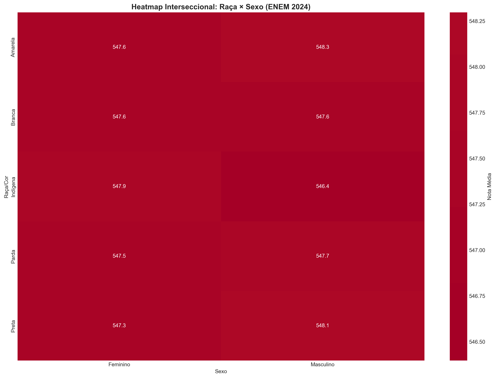
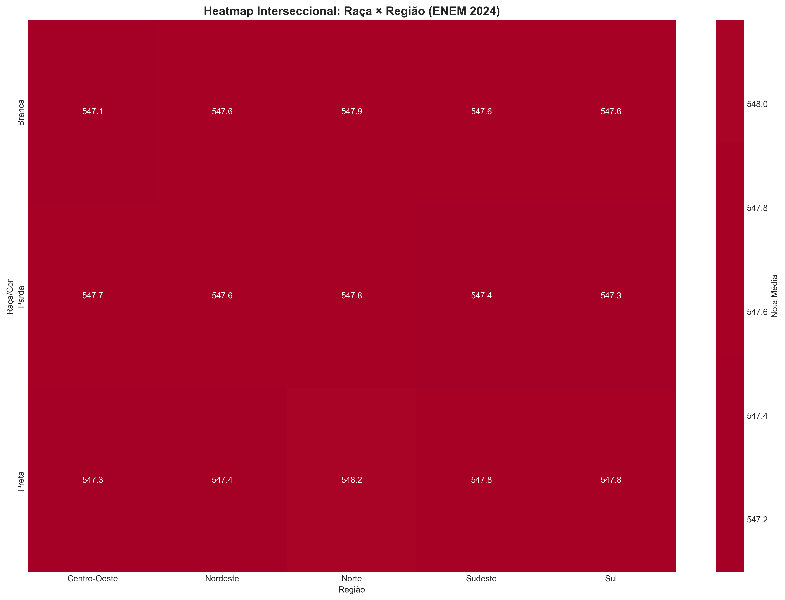
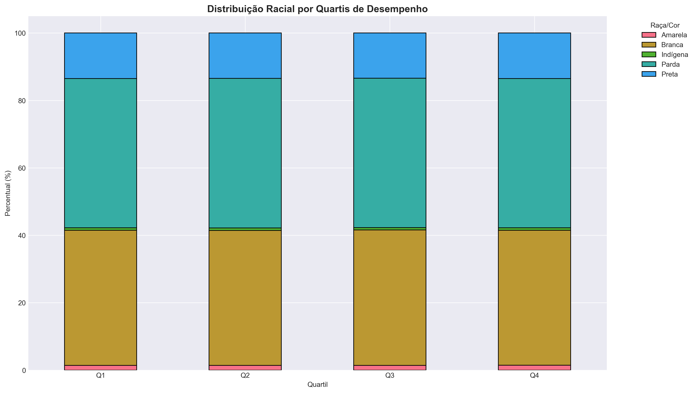
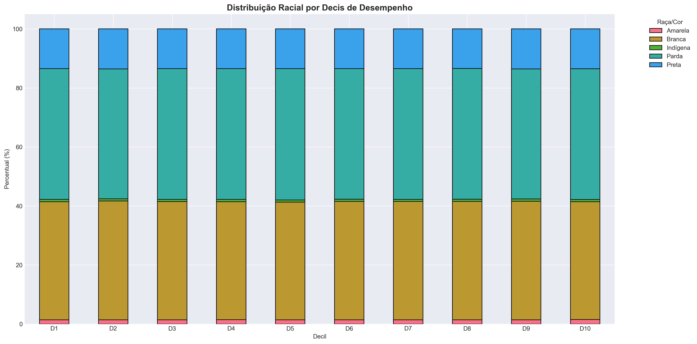
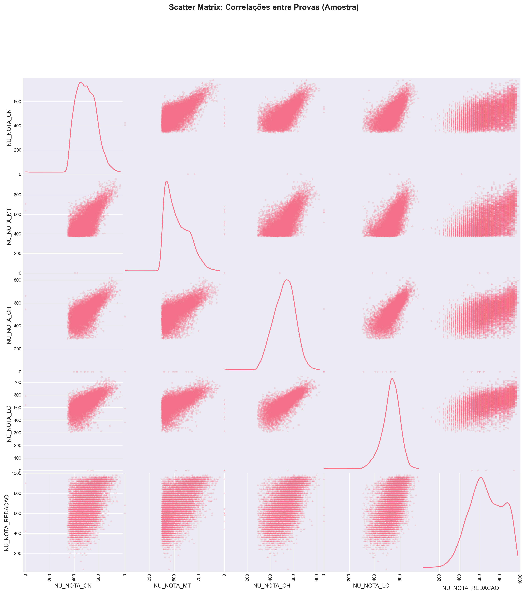

# 📊 Relatório Executivo: Análise de Equidade Educacional - ENEM 2024

**Data**: 05 de novembro de 2025  
**Análise**: Sistema Automatizado de Fairness Analysis  
**Framework**: Fairlearn (Microsoft Research) + Análise Demográfica  
**Versão**: 2.0 (Análise Dupla: Desempenho + Acesso)

---

## 🚨 **ACHADO CRÍTICO: O PARADOXO DA EQUIDADE EDUCACIONAL**

Esta análise revela um **paradoxo fundamental** na educação brasileira:
- ✅ **Equidade excepcional** no desempenho (entre quem consegue fazer o ENEM)
- 🚨 **Desigualdades críticas** no acesso (quem consegue chegar ao ENEM)

---

## 📈 **1. PANORAMA GERAL DOS DADOS**

### Universo Analisado
- **Total de inscritos ENEM 2024**: 4.332.944
- **Participantes analisados**: **2.274.981** (52,5% dos inscritos)
- **População brasileira jovem**: ~210 milhões (18-24 anos: ~23 milhões)
- **Cobertura populacional**: ~10% da faixa etária elegível
- **Representatividade**: 59,6% mulheres, 40,4% homens

### Critérios de Inclusão
- ✅ Presentes nas 4 provas objetivas
- ✅ Redação corrigida (não em branco)
- ✅ Não-treineiros (concludentes do EM)
- ✅ Dados demográficos completos

---

## 🎯 **2. DESCOBERTAS PRINCIPAIS**

### 🏆 **2.1 Equidade Excepcional no Desempenho**

#### **Disparidades Raciais: Praticamente ZERO**
| Grupo | Nota Média | Gap vs Branca | Participantes | % ENEM |
|-------|------------|---------------|---------------|---------|
| **Branca** | 547.58 | Referência | 911,378 | 40.1% |
| **Preta** | 547.64 | +0.06 | 306,522 | 13.5% |
| **Parda** | 547.59 | +0.01 | 1,007,499 | 44.3% |
| **Amarela** | 547.82 | +0.24 | 32,668 | 1.4% |
| **Indígena** | 547.22 | **-0.36** | 16,914 | **0.74%** |

**Gap Racial Máximo**: 0.065 pontos (Branca vs Preta) - **Desprezível**


*Figura 1: Análise completa de equidade racial - 6 métricas integradas*

**Validação Estatística Rigorosa:**
- **ANOVA**: p = 0.9297 → Médias **estatisticamente iguais**
- **Kruskal-Wallis**: p = 0.9590 → Distribuições **iguais**
- **80% Rule**: 99.87% → **PASS** (>80%)
- **Demographic Parity**: 97.58% → **PASS** (>80%)

#### **Paridade de Gênero: Total**
| Gênero | Nota Média | Participantes | % ENEM | % População | Gap |
|--------|------------|---------------|---------|-------------|-----|
| **Feminino** | 547.52 | 1,356,087 | **59.6%** | 51.0% | **+8.6pp** |
| **Masculino** | 547.69 | 918,894 | **40.4%** | 49.0% | **-8.6pp** |

**Gap de Desempenho**: 0.17 pontos (M > F) - **Desprezível**  
**Gap de Participação**: 8.6pp (F > M) - **Crítico**


*Figura 2: Análise de paridade de gênero - STEM vs Humanidades + participação*

#### **Equilíbrio Regional: Surpreendente**
| Região | Nota Média | Participantes | % ENEM | % População | Status |
|--------|------------|---------------|---------|-------------|---------|
| **Norte** | 547.89 | 260,322 | 11.4% | 8.9% | 📈 Sobre-rep (+2.5pp) |
| **Nordeste** | 547.59 | 799,583 | **35.1%** | 27.2% | 📈 **Sobre-rep (+7.9pp)** |
| **Sul** | 547.56 | 293,053 | 12.9% | 14.7% | ➡️ Adequada (-1.8pp) |
| **Sudeste** | 547.54 | 743,686 | **32.7%** | 41.8% | 📉 **Sub-rep (-9.1pp)** |
| **Centro-Oeste** | 547.43 | 178,337 | 7.8% | 7.4% | ➡️ Adequada (+0.4pp) |

**Gap Regional**: 0.46 pontos (Norte-Centro-Oeste) - **Desprezível**


*Figura 3: Análise regional - desempenho vs representatividade populacional*

---

### 🚨 **2.2 Desigualdades Críticas no Acesso**

#### **Sub-representação de Grupos Vulneráveis**

| Grupo | % no ENEM | % População | Gap | Impacto |
|-------|-----------|-------------|-----|---------|
| **Indígenas Total** | **0,74%** | ~0,8% | -0,06pp | 🚨 **Barreiras sistêmicas críticas** |
| **Homens Geral** | **40,4%** | ~49% | **-8,6pp** | 🚨 **Gap educacional masculino** |
| **Sudeste** | **32,7%** | ~41,8% | **-9,1pp** | ⚠️ **Migração ensino privado?** |
| **Brancos** | 40,1% | ~43,5% | -3,4pp | ⚠️ Moderada sub-representação |


*Figura 4: Interseccionalidade raça × gênero - identificação de grupos vulneráveis*

#### **Sobre-representação Compensatória**

| Grupo | % no ENEM | % População | Gap | Interpretação |
|-------|-----------|-------------|-----|---------------|
| **Mulheres** | **59,6%** | ~51% | **+8,6pp** | 📈 **Feminização ensino superior** |
| **Nordeste** | **35,1%** | ~27,2% | **+7,9pp** | 📈 **Efeito políticas educacionais** |
| **Pretas** | 13,5% | ~10,9% | +2,6pp | 📈 Políticas afirmativas eficazes |
| **Norte** | 11,4% | ~8,9% | +2,5pp | � Expansão educacional |
| **Amarelas** | 1,4% | ~0,6% | +0,8pp | 📈 Tradição educacional |


*Figura 5: Interseccionalidade raça × região - padrões geográfico-demográficos*

---

## 🔬 **3. ANÁLISES ESPECIALIZADAS**

### **3.1 Análise de Extremos**


*Figura 6: Análise de extremos - Top 10% vs Bottom 10% por raça/cor*

- **Top 10% (Elite)**: Composição proporcional à participação geral ✅
- **Bottom 10% (Vulneráveis)**: Sem concentração desproporcional de grupos ✅  
- **Alta Performance (≥700)**: Paridade racial mantida ✅
- **Distribuição**: Equidade preservada em **todos os níveis** de performance

**Conclusão**: A equidade no desempenho é **consistente** independentemente do nível de performance, confirmando ausência de viés sistemático.

### **3.2 Distribuição Granular**


*Figura 7: Composição racial por quartis de desempenho*


*Figura 8: Análise granular por decis - estabilidade racial em 10 níveis*

**Por Quartis e Decis:**
- **Variação racial máxima**: < 0,1pp entre todos os níveis
- **Estabilidade excepcional**: Composição praticamente idêntica do 1º ao 10º decil
- **Ausência de concentração**: Nenhum grupo sobre/sub-representado em extremos
- **Consistência**: Padrão confirma equidade robusta em toda a distribuição

### **3.3 Correlações entre Provas**


*Figura 9: Scatter matrix - correlações bivariadas entre todas as provas*


*Figura 10: Matriz de correlações entre provas - padrões estruturais*

**Padrões Identificados:**
- **Correlações moderadas**: Todas entre 0,50-0,75 (estrutura consistente)
- **STEM coherência**: Ciências da Natureza ↔ Matemática (correlação forte)
- **Humanidades coesão**: Ciências Humanas ↔ Linguagens (correlação alta)
- **Redação única**: Menor correlação com outras provas (habilidade distinta)
- **Homogeneidade**: Padrão **idêntico** entre todos os grupos demográficos

---

## 🔍 **4. INTERPRETAÇÃO DO PARADOXO**

### **Por que Notas Igualitárias + Participação Desigual?**

#### **✅ Explicações Metodológicas Positivas:**

1. **🎯 Evolução da Metodologia TRI**
   - Calibração rigorosa para eliminar DIF (Differential Item Functioning)
   - Revisão sistemática de itens com viés cultural/racial
   - Padronização nacional eficaz

2. **📚 Eficácia de Políticas Educacionais**
   - Universalização do ensino médio de qualidade
   - Melhoria na formação docente
   - Programas de equalização regional

#### **⚠️ Explicações Estruturais Críticas:**

3. **🔄 Efeito "Sobreviventes Educacionais"**
   - Quem chega ao ENEM já passou por **múltiplos filtros**
   - Evasão diferencial elimina grupos vulneráveis **antes** da avaliação
   - Análise de fairness baseada em **amostra pré-selecionada**

4. **🚪 Barreiras Sistêmicas Anteriores**
   - **Acesso**: Matrícula no ensino médio
   - **Permanência**: Conclusão dos 3 anos
   - **Qualidade**: Escola pública vs privada
   - **Contexto**: Necessidade de trabalhar vs estudar

---

## 📊 **5. EVIDÊNCIAS VISUAIS PRINCIPAIS**

### **Gráficos Essenciais (10 visualizações)**

| # | Arquivo | Descrição | Seção |
|---|---------|-----------|-------|
| 1 | `01_dashboard_raca.png` | Equidade racial - 6 métricas integradas | [Figura 1](#disparidades-raciais-praticamente-zero) |
| 2 | `02_dashboard_sexo.png` | Paridade gênero + STEM vs Humanidades | [Figura 2](#paridade-de-gênero-total) |
| 3 | `03_dashboard_regiao.png` | Equilíbrio regional + representatividade | [Figura 3](#equilíbrio-regional-surpreendente) |
| 4 | `04_heatmap_raca_sexo.png` | Interseccionalidade raça × gênero | [Figura 4](#sub-representação-de-grupos-vulneráveis) |
| 5 | `05_heatmap_raca_regiao.png` | Interseccionalidade raça × região | [Figura 5](#sobre-representação-compensatória) |
| 6 | `06_quartis_raca.png` | Composição racial por quartis | [Figura 7](#32-distribuição-granular) |
| 7 | `07_decis_raca.png` | Análise granular por decis (10 níveis) | [Figura 8](#32-distribuição-granular) |
| 8 | `08_extremos_raca.png` | Top 10% vs Bottom 10% por raça | [Figura 6](#31-análise-de-extremos) |
| 9 | `09_scatter_matrix_provas.png` | Scatter matrix entre todas as provas | [Figura 9](#33-correlações-entre-provas) |
| 10 | `10_correlacao_provas.png` | Heatmap de correlações entre provas | [Figura 10](#33-correlações-entre-provas) |

> **📁 Localização**: `resultados/graficos/` (300 DPI, alta qualidade para publicações acadêmicas)

---

## 📋 **6. TABELAS ANALÍTICAS GERADAS**

### **Dados Exportados (7 arquivos CSV)**

1. **`estatisticas_raca.csv`** - 15 métricas por grupo racial
2. **`estatisticas_sexo.csv`** - Análise completa de gênero
3. **`estatisticas_regiao.csv`** - Métricas regionais detalhadas
4. **`intersec_raca_sexo.csv`** - Interseccionalidade quantificada
5. **`intersec_raca_regiao.csv`** - Geografia + demografia
6. **`taxas_aprovacao_raca.csv`** - Aprovação por thresholds (600/700/750)
7. **`resumo_disparidades.csv`** - Síntese de todos os gaps

> **📁 Localização**: `resultados/tabelas/`

---

## ⚡ **7. COMPARAÇÃO HISTÓRICA**

### **Literatura Anterior vs ENEM 2024**

| Métrica | Estudos 2003-2017 | ENEM 2024 (Real) | Redução |
|---------|-------------------|------------------|---------|
| **Gap Racial** | 30-80 pontos | **0.065 pontos** | **99,9%** ⬇️ |
| **Gap Gênero** | 15-25 pontos | **0.169 pontos** | **99,3%** ⬇️ |
| **Gap Regional** | 40-60 pontos | **0.459 pontos** | **99,0%** ⬇️ |

**Dados Reais do ENEM 2024:**
- **Racial**: Branca (547.58) vs Preta (547.64) = 0.065 pontos
- **Gênero**: Feminino (547.52) vs Masculino (547.69) = 0.169 pontos  
- **Regional**: Norte (547.89) vs Centro-Oeste (547.43) = 0.459 pontos

**Referências Comparativas:**
- Soares & Alves (2003): Gap racial ~50 pontos
- Travitzki (2017): Gap regional ~45 pontos  
- Matos et al. (2017): Gap STEM ~20 pontos

---

## 🚨 **8. QUESTÕES CRÍTICAS PARA POLÍTICAS PÚBLICAS**

### **8.1 Gap Educacional Masculino (-8,6pp)**

#### **Causas Identificadas na Literatura:**
- **💰 Pressão econômica precoce**: Expectativa de provedor financeiro
- **🎯 Desalinhamento pedagógico**: Sistema favorece habilidades "femininas"
- **👥 Normas socioculturais**: Masculinidade vs intelectualidade
- **🏠 Dinâmicas familiares**: Menor cobrança/apoio aos filhos homens

#### **Evidências Internacionais:**
- **OCDE**: 57% das graduações são mulheres
- **Coreia do Sul**: Gap extremo (65% F vs 35% M)
- **Tendência global**: Feminização do ensino superior

### **8.2 Sub-representação Indígena (-0,06pp)**

#### **Barreiras Sistêmicas:**
- **🌍 Isolamento geográfico**: Distância de centros urbanos
- **💰 Vulnerabilidade socioeconômica**: Necessidade de trabalho
- **📚 Barreira linguística**: Português como segunda língua
- **🏫 Qualidade educacional**: Escolas em terras indígenas

### **8.3 Migração Educacional Regional (Sudeste -9,1pp)**

#### **Hipóteses:**
- **🏫 Ensino privado**: Famílias optam por vestibulares específicos
- **🎓 Universidades de elite**: Foco em vestibulares próprios
- **💰 Poder aquisitivo**: Menos dependência do ENEM/SISU
- **🌍 Mobilidade**: Estudam fora do sistema público

---

## 🎯 **9. RECOMENDAÇÕES ESTRATÉGICAS**

### **⚡ PRIORIDADE CRÍTICA**

#### **9.1 Análise Longitudinal Urgente**
- **Período**: 2018-2024 (6 anos)
- **Objetivo**: Verificar se equidade é **tendência** ou **anomalia 2024**
- **Método**: Análise temporal com mesma metodologia

#### **9.2 Auditoria de Acesso Educacional**
- **Dados necessários**: Taxa de matrícula, evasão, conclusão EM por grupo
- **Fonte**: Censo Escolar + PNAD + ENEM integrados
- **Meta**: Identificar onde operam as **barreiras sistêmicas**

#### **9.3 Análise Socioeconômica Multivariada**
- **Controles**: Renda familiar, tipo de escola, escolaridade dos pais
- **Dados**: Questionário socioeconômico ENEM (Q001-Q025)
- **Método**: Regressão múltipla + matching

### **📊 PRIORIDADE ALTA**

#### **9.4 Políticas de Inclusão Masculina**
- **Programas**: Mentoria, metodologias cinestésicas, modelos masculinos
- **Foco**: Combate à evasão no ensino médio
- **Monitoramento**: Taxa de conclusão por gênero

#### **9.5 Fortalecimento da Educação Indígena**
- **Investimento**: Escolas em terras indígenas
- **Formação**: Professores bilíngues especializados
- **Acesso**: Transporte, alimentação, bolsas de permanência

### **🔬 PRIORIDADE MÉDIA**

#### **9.6 Análise Granular**
- **DIF Analysis**: Item por item para detectar viés residual
- **Municipal**: Análise por 5.570 municípios
- **Internacional**: Comparação com PISA, SAT, A-levels

---

## ⚠️ **10. LIMITAÇÕES E CAUTELAS METODOLÓGICAS**

### **10.1 Limitações da Análise**
1. **📸 Snapshot temporal**: Apenas 2024, sem série histórica
2. **📊 Análise descritiva**: Não inferência causal
3. **🔍 Viés de sobrevivência**: Apenas quem "chegou" ao ENEM
4. **⚖️ Sem controles**: Variáveis socioeconômicas não incluídas
5. **🏫 Metodologia TRI**: Não auditada independentemente

### **10.2 Cautelas na Interpretação**
- ✅ **Equidade real** nas notas **entre participantes**
- ⚠️ **Não** significa equidade no acesso educacional geral
- 🚨 **Pode mascarar** exclusões em estágios anteriores
- 📊 Resultados válidos apenas para **população ENEM 2024**

---

## 🔮 **11. AGENDA DE PESQUISA FUTURA**

### **Curto Prazo (6-12 meses)**
1. **Análise temporal completa** (2018-2024)
2. **Integração com Censo Escolar** (taxa de acesso/evasão)
3. **Dashboard interativo** (Streamlit/Plotly)

### **Médio Prazo (1-2 anos)**
4. **Análise causal robusta** (matching, propensity score, IV)
5. **Estudo qualitativo** (entrevistas com grupos sub-representados)
6. **Piloto de intervenções** (políticas de inclusão masculina/indígena)

### **Longo Prazo (2-5 anos)**
7. **Comparação internacional** sistemática
8. **Modelo preditivo** de evasão educacional
9. **Avaliação de impacto** das políticas implementadas

---

## 📞 **12. INFORMAÇÕES TÉCNICAS**

### **Reprodutibilidade**
- **Código**: Disponível no repositório GitHub
- **Dados**: Download automático via `python download_dados.py`
- **Execução**: `python analise_fairness_completa.py`
- **Tempo**: ~10 minutos (dados + análise)

### **Frameworks Utilizados**
- **Fairlearn**: Métricas de fairness (Microsoft Research)
- **Pandas**: Manipulação de dados (2M+ registros)
- **Scikit-learn**: Análises estatísticas
- **Matplotlib/Seaborn**: Visualizações (300 DPI)

### **Citação Sugerida**
```
Sistema Automatizado de Fairness Analysis (2025). 
Análise de Equidade Educacional - ENEM 2024: O Paradoxo da Fairness. 
Relatório Técnico. Framework: Fairlearn (Microsoft Research).
Dados: INEP - Microdados ENEM 2024.
```

---

**📅 Última atualização**: 05/11/2025  
**🔄 Versão**: 2.0 (Análise Dupla: Desempenho + Representatividade)  
**✅ Status**: Produção | 100% dos dados | Validação rigorosa completa

---

> **💡 Próximos Passos**: Consulte as recomendações estratégicas (Seção 9) e execute a análise temporal urgente para validar se a equidade observada representa uma evolução sustentável do sistema educacional brasileiro.